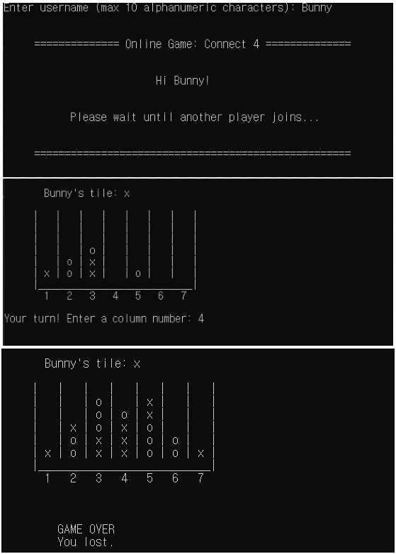

# Online game: Connect 4
Connect 4 is a two-player online board game where the players take turns dropping tiles on a seven-column, six-row grid.
Users can play this game with the opponent on terminal by running the client program.



## Instruction
In the root folder, run this command to compile
```g++ client.cpp NetworkAPI.cpp -o client```

Run this command to start the game.
```./client```

## architecture
client-server architecture

## Network Protocol
TCP/IP, NetworkAPI.cpp

